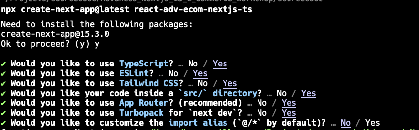
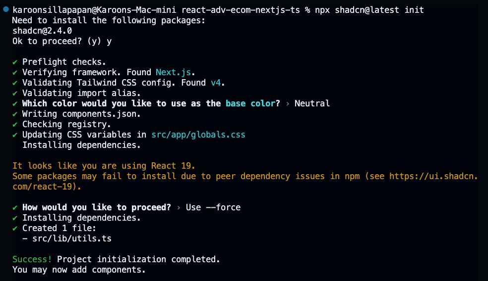

# project react-adv-ecom-nextjs-ts

[git repo](https://github.com/ksupdev/react-adv-ecom-nextjs-ts)

## Setup project

```shell
# create project
npx create-next-app@latest react-adv-ecom-nextjs-ts
```


- run project `npm run dev`

## Include Google front for work with tailwind

### Decare custom front on Tailwind
```typescript
/* globals.css */
@import "tailwindcss";

@theme {
  --font-k2d: "K2D";
  --font-sarabun: "Sarabun";
  --font-kanit: "Kanit";
}

```

### Include Google front from next/font/google
- By default, there's no need to include fonts from a CDN or external sources, as Next.js offers an optimized built-in solution. If you need to use custom fonts, consider integrating them in a way similar to next/font/google rather than relying on outdated methods.

```typescript
/* fonts.css */
import { K2D, Kanit, Sarabun } from 'next/font/google';

const k2d = K2D({
    subsets: ['thai'],
    weight: ['100', '200', '300', '400', '500', '600', '700', '800'],
    display: 'swap',
    variable: '--font-k2d'
});

const sarabun = Sarabun({
    subsets: ['thai'],
    weight: ['100', '200', '300', '400', '500', '600', '700', '800'],
    display: 'swap',
    variable: '--font-sarabun'
});

const kanit = Kanit({
    subsets: ['thai'],
    weight: ['100', '200', '300', '400', '500', '600', '700', '800'],
    display: 'swap',
    variable: '--font-kanit'
});

export { k2d, sarabun, kanit };

/*
    variable => You have to config link to the custom front defind on global.css
*/

```

### How to use

```typescript
/* src/app/contact/page.tsx */
import { sarabun, kanit } from "../fonts";

export default function ContactPage() {
    return (
        <main>
            <h2 className="font-k2d text-3xl text-blue-300">Contact us</h2>
            <p>สวัสดี contact Page</p>
            <p className="font-kanit">สวัสดี kanit contact Page</p>
            <p className={sarabun.className}>สวัสดี sarabun contact Page</p>
            <p className={kanit.className}>สวัสดี kanit contact Page</p>
        </main>
    )
}

```

## Use shadcn/ui template
[official doc , installation with Next.js](https://ui.shadcn.com/docs/installation/next)

### Install

```shell
npx shadcn@latest init
```



```shell
npx shadcn@latest add button
```
- You have to install some component, after install complete. it auto add `'tw-animate-css'`


## demo template original template
[react-tailwind-snippets](https://react-tailwind-snippets.vercel.app/)

[tailwindflex](https://tailwindflex.com/)

## Use shadcn template
[ref](https://ui.shadcn.com/blocks/login)

```shell
npx shadcn@latest add login-01
```

## Route Group (for support multiple layout)

- คือการสร้าง folder ที่มี `(-Name of group-)` ซึ่งจะไม่มีผลต่อยการทำ Routing อะไรเลย โดย folder นี้จะทำหน้าที่เป็น group of folder ซึ่งเราสามารถ define `layout.tsx` ให้สามารถใช้งานได้เฉพาะ components ที่อยู่ภายใน folder นี้ได้

- ในส่วนของ Nested Layouts ไม่จำเป็นต้องมีการ ใช้ tags html, body ไม่งั้นจะเจอ error 

``` <body> cannot contain a nested <html>.
See this log for the ancestor stack trace.

```
how to fix

```typescript
export default function FrontLayout({
    children,
}: Readonly<{
    children: React.ReactNode;
}>) {
    return (
        <>
            <AppHeader />
            {children}
        </>
    );
}

```

## Install Dashboard and after generate (https://ui.shadcn.com/blocks)

```shell
npx shadcn@latest add dashboard-01
```

## Rendering concept

- static route => จะเป็นการ Fix content ซึ่งจะสามารถเก็บ catch ได้ดีและเร็วซึ่งจะทำการ build ครั้งเดียวตั้งแต่การ Build แต่ก็สามารถจะ set เวลาให้มีการอัพเดตได้ `rendered on the server at build time`

- dynamic route => จะเป็นการ generate conent ใหม่ทุกครั้งที่มีการ render `server at request time`

## Config server-only

```shell
npm install server-only
```

เป็นการกำหนดว่าถ้ามีการเรียกใช้ Method หรือ file ที่มีการกำหนด `import server-only` จากทาง client side จะมีการแจ้ง error ทันที


